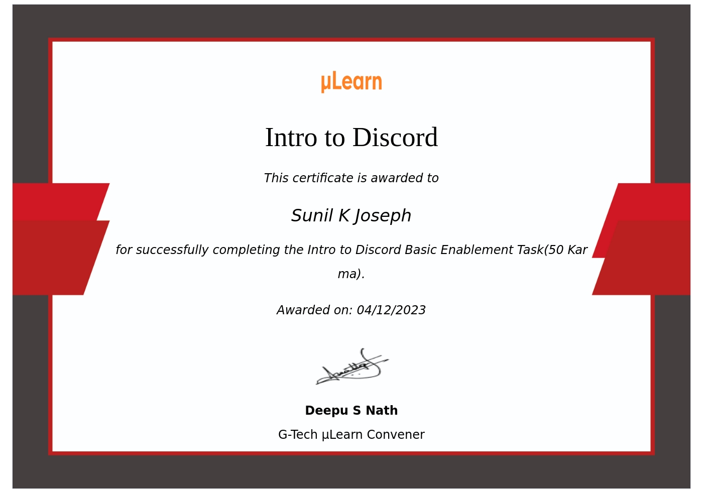
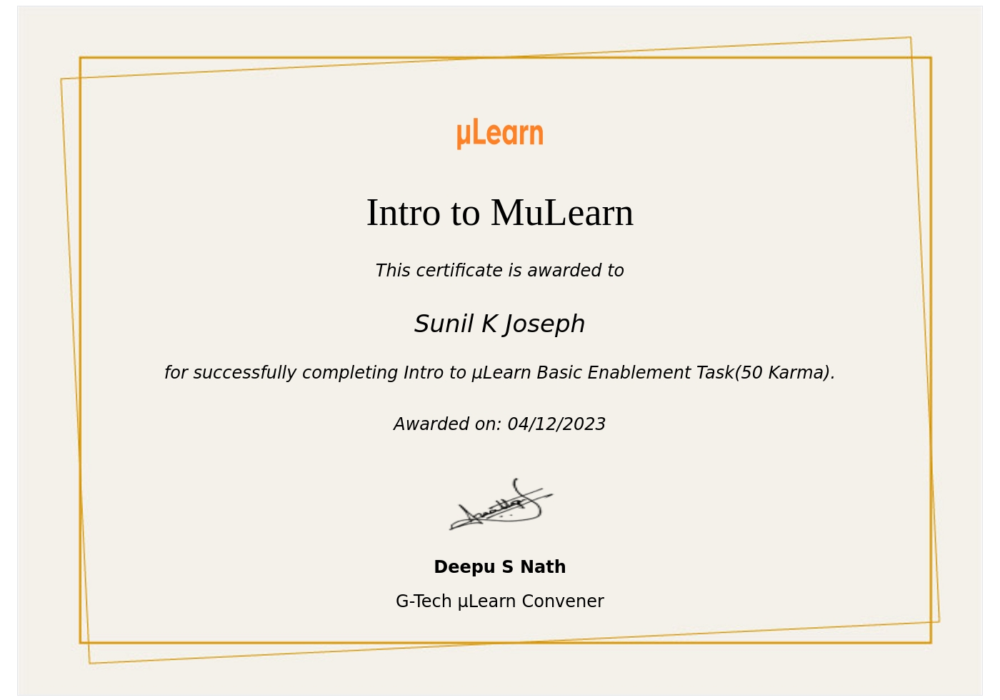
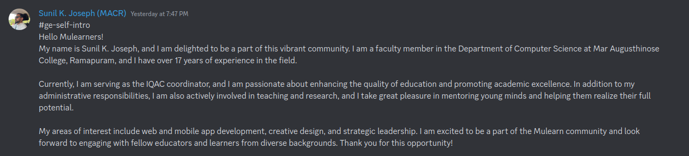

# One day with the MuLearn Community
Welcome to the μLearn community! As a new member, you may be wondering what exactly this community is all about and what kind of activities you can expect to participate in. In this blog post, we'll explore some of the tasks that you may encounter as a new member of the μLearn community, and I'll share my personal experience with these tasks.

Task 1: Self Introduction to the community

The first task that you'll likely encounter when joining the μLearn community is introducing yourself to other members. This is a great opportunity to let others know who you are, what your interests are, and what you hope to gain from being a part of this community. When I introduced myself, I shared a little bit about my background in software development and my interest in learning new technologies.

Task 2: Introduction to Discord

Discord is the platform that the μLearn community uses to communicate and collaborate. As a new member, you'll need to join the community's Discord server and familiarize yourself with its features. This may include creating a profile, joining different channels, and learning how to send messages and interact with other members. When I first joined Discord, I found it to be a very welcoming and active community, with members always willing to help out and answer questions.

Task 3: Introduction to μLearn

Of course, the main focus of the μLearn community is learning! You'll need to become familiar with what the community is all about and the kinds of topics that are discussed. This may include reading through the community's website and documentation, joining in on discussions, and exploring some of the resources that are available. When I first started learning about μLearn, I was impressed by the variety of topics that were covered, from machine learning and data science to web development and beyond.

Task 4: Introduction to GitHub

GitHub is a platform that is used for version control and collaboration in software development. As a member of the μLearn community, you'll need to create a GitHub account and become familiar with its features. This may include learning how to create and fork repositories, make pull requests, and work collaboratively with other members. When I first started using GitHub, I found it to be a little intimidating, but with the help of the community and some online tutorials, I was able to get up to speed quickly.

Task 5: Introduction to Markdown

Markdown is a lightweight markup language that is used to create formatted text documents. As a member of the μLearn community, you'll need to become familiar with Markdown so that you can create and share your own documents and tutorials. This may include learning how to create headers, lists, links, and images using Markdown syntax. When I first started using Markdown, I found it to be a very useful tool for creating documentation and blog posts.

Task 6: Introduction to Command Line

Finally, as a member of the μLearn community, you'll need to become familiar with the command line interface. This may include learning how to navigate directories, create and modify files, and run commands using the terminal. When I first started using the command line, I was a little nervous, but with the help of the community and some online resources, I was able to become more comfortable with this powerful tool.

In conclusion, the μLearn community is a great place to learn new skills, connect with other like-minded individuals, and contribute to open-source projects. Whether you're a beginner or an experienced developer, there's always something new to learn and explore. By completing these different onboarding tasks, you'll be well on your way to becoming an active and engaged member of this community.

